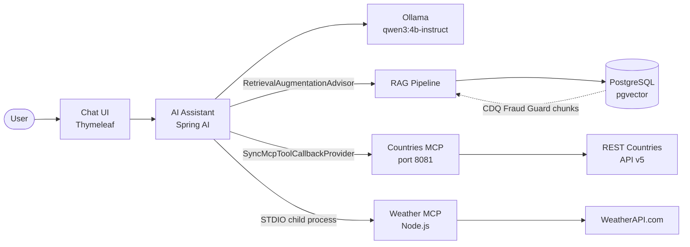
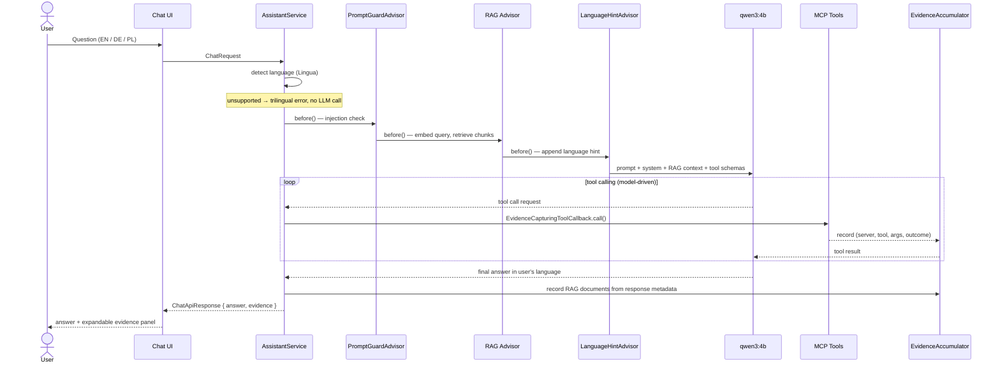
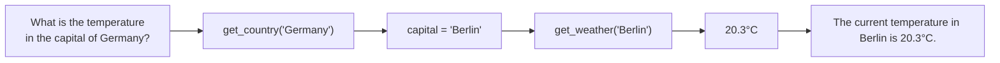

# AI Assistant

> A local-first AI assistant combining semantic product knowledge (RAG), real-time external data (MCP tool calling), and multi-tool orchestration — built with Spring AI, Ollama, and pgvector.

     

[Architecture](#architecture) · [Quick Start](#quick-start) · [Tests](#tests) · [Docs](#documentation)

---

## What this project demonstrates

| Capability | Where |
|---|---|
| **RAG** — semantic product knowledge retrieval from pgvector | [`rag/`](ai-assistant/src/main/java/com/example/cdq/rag/) |
| **Custom MCP server** — Countries REST API wrapped as Spring AI MCP | [`countries-mcp-server/`](countries-mcp-server/) |
| **External MCP integration** — Weather via forked stdio Node.js server | [`external/mcp-weather/`](external/mcp-weather/) |
| **Multi-tool chaining** — model resolves capital via Countries, then fetches weather | [`ChatEndToEndIT`](ai-assistant/src/test/java/com/example/cdq/chat/ChatEndToEndIT.java) |
| **Execution evidence** — every response carries tool calls + RAG source provenance | [`evidence/`](ai-assistant/src/main/java/com/example/cdq/evidence/) |
| **Multilingual responses** — EN / DE / PL via Lingua + prompt injection | [`InputLanguageDetector`](ai-assistant/src/main/java/com/example/cdq/chat/InputLanguageDetector.java) |
| **Versioned RAG lifecycle** — hash-based idempotent ingestion, rollback without re-embedding | [`lifecycle/`](ai-assistant/src/main/java/com/example/cdq/rag/lifecycle/) |
| **Benchmark-driven model selection** — `think=false` failure investigated and quantified | [`docs/why-ollama-instant.md`](docs/why-ollama-instant.md) |
| **Prompt injection guard** — pattern-based advisor at highest precedence | [`PromptGuardAdvisor`](ai-assistant/src/main/java/com/example/cdq/config/PromptGuardAdvisor.java) |
| **Local inference** — all LLM and embedding calls run through Ollama | `qwen3:4b-instruct` / `qwen3-embedding:0.6b` |

---

## Demo

> **TODO:** Add `docs/assets/demo.gif` — suggested: 60–90 s showing a multilingual multi-tool chain question, the evidence panel expanding to reveal tool calls and RAG sources, and a language switch mid-session.

---

## Quick Start

### Try it with Claude Code

If you have [Claude Code](https://claude.ai/code) installed, paste the prompt below into your terminal. Claude will check prerequisites, clone the repo, pull Ollama models, start all services, and open the app.

```bash
claude "Set up and run the AI Assistant project from https://github.com/krystiandev1/AI-Assistant.git.

First, check that the following are installed and print their versions: Java 21+ (java -version), Docker (docker info), Node.js 18+ (node -v), Ollama (ollama list). If any prerequisite is missing, stop and tell me what to install.

Then execute these steps in order:
1. Clone the repository into ./AI-Assistant and cd into it.
2. Pull Ollama models: ollama pull qwen3:4b-instruct and ollama pull qwen3-embedding:0.6b (these run locally — no API key needed).
3. Create .env by copying .env.example. Leave WEATHER_API_KEY empty for now (weather tool will be unavailable without it; all other features work).
4. Create countries-mcp-server/.env with REST_COUNTRIES_API_KEY=demo and REST_COUNTRIES_BASE_URL=https://restcountries.com/v3.1 (the key field is required by config but countries API works without auth).
5. Start PostgreSQL: docker compose up -d postgres. Wait for it to be healthy.
6. Build the weather MCP server: cd external/mcp-weather && npm install && npm run build && cd ../..
7. Start the countries MCP server in a background process: ./mvnw spring-boot:run -pl countries-mcp-server
8. Build and start the AI assistant: ./mvnw -pl ai-assistant package -DskipTests && java -jar ai-assistant/target/ai-assistant-0.1.0-SNAPSHOT.jar
9. When the app is up, open http://localhost:8080 in the browser.

Report progress after each step and surface any errors immediately."
```

> Weather and country data require free API keys from [WeatherAPI.com](https://www.weatherapi.com/signup.aspx) and [REST Countries](https://restcountries.com/sign-up). The app starts without them — RAG and model-knowledge questions work out of the box.

---

### Manual setup

**Prerequisites:** Java 21 · Docker · [Ollama](https://ollama.com) · Node.js 18+ · two free API keys (below)

### 1. Pull Ollama models

```bash
ollama pull qwen3:4b-instruct      # default chat model
ollama pull qwen3:4b               # task-specified model (optional)
ollama pull qwen3-embedding:0.6b   # required
```

### 2. API keys

| Service | Sign up | Purpose |
|---|---|---|
| REST Countries v5 | https://restcountries.com/sign-up | Country data |
| WeatherAPI.com | https://www.weatherapi.com/signup.aspx | Current weather |

```bash
cp .env.example .env
# set WEATHER_API_KEY in .env
# create countries-mcp-server/.env with REST_COUNTRIES_API_KEY and REST_COUNTRIES_BASE_URL
```

### 3. Start services

```bash
# PostgreSQL
docker compose up -d postgres

# Build weather MCP (once after checkout)
cd external/mcp-weather && npm install && npm run build && cd ../..

# Countries MCP server (separate terminal)
./mvnw spring-boot:run -pl countries-mcp-server

# AI assistant
./mvnw -pl ai-assistant package -DskipTests
java -jar ai-assistant/target/ai-assistant-0.1.0-SNAPSHOT.jar
```

Open **http://localhost:8080** — RAG ingestion runs automatically on first start (~5 s).

> **Windows + SSL-intercepting antivirus?** Add `-Djavax.net.ssl.trustStoreType=Windows-ROOT` to the java commands above.

---

## Architecture



Three independent knowledge paths are available on every request. The model decides which to use — RAG context arrives automatically; tools are called only when needed.

---

## Request Flow



Advisor order is intentional: RAG runs **before** the language hint so the pgvector embedding query uses the clean original question. The hint is invisible to the embedding model but visible to the LLM when composing the answer.

---

## Knowledge Sources

| Capability | Source | Integration | Example |
|---|---|---|---|
| Product knowledge | CDQ Fraud Guard page | RAG + pgvector | *"How does CDQ Fraud Guard verify bank accounts?"* |
| Country facts & capitals | REST Countries v5 | Custom MCP (HTTP) | *"What is the capital of Germany?"* |
| Current weather | WeatherAPI.com | External MCP (stdio) | *"What is the temperature in Munich?"* |
| Compound questions | Multiple tools | Tool chaining | *"What is the temperature in the capital of Germany?"* |

---

## Tool Chaining



The model orchestrates multi-tool sequences without any hardcoded workflow. The tool description on `get_country` explicitly states: *"The returned 'capital' field can be used directly as input to the get_weather tool."* — this single sentence is what makes reliable chaining possible.

---

## Multilingual Behavior

The assistant responds in the user's language — English, German, or Polish — across all routing paths: model knowledge, RAG, and tool results.

Detection uses [Lingua](https://github.com/pemistahl/lingua-rs), a statistical n-gram model across ~75 languages, with character-marker fast paths (Polish diacritics, German umlauts) and function-word fallback for very short queries. Using a wide 75-language model rather than a narrow 3-language classifier is deliberate — a narrow classifier forces nearest-match, misclassifying unsupported languages as one of the three. Inputs in unsupported languages are rejected before any LLM call.

Once the language is identified, `LanguageHintAdvisor` appends a bilingual constraint **after** RAG retrieval (so the embedding query stays clean) and **before** tool calling:

```
[Respond in Polish / Odpowiedz po polsku. Use English for tool arguments.]
```

The "Use English for tool arguments" clause prevents localized city names (`"Monachium"`) from breaking tool calls that expect English input (`"Munich"`).

→ [Full design and test coverage](docs/language-detection.md)

---

## Prompt Injection Guard

All user input passes through `PromptGuardAdvisor` at `Ordered.HIGHEST_PRECEDENCE` — before RAG retrieval, before any LLM call.

The advisor matches the user message against 14 regex patterns:

| Category | Covered patterns |
|---|---|
| Instruction override | `ignore * instructions`, `forget * instructions`, `disregard * instructions`, `override the system prompt` |
| Role manipulation | `pretend you are`, `jailbreak`, `do anything now`, `new system prompt` |
| Model control tokens | `[INST]`, `<<SYS>>`, `<\|system\|>`, `<\|im_start\|>`, `### System`, `### Instruction` |

If any pattern matches, the request is rejected immediately — no RAG retrieval, no LLM call:

```
HTTP 400 Bad Request
{"error": "Your request contains content that cannot be processed."}
```

→ [`PromptGuardAdvisor.java`](ai-assistant/src/main/java/com/example/cdq/config/PromptGuardAdvisor.java)

---

## Showcase Questions

| Lang | Question | Capability exercised |
|---|---|---|
| EN | *What is the capital city of Germany?* | Countries MCP → `get_country("Germany")` |
| DE | *Was ist die Hauptstadt von Deutschland?* | Countries MCP (German input) |
| PL | *Jakie jest miasto stołeczne Niemiec?* | Countries MCP (Polish input) |
| EN | *What is the temperature currently in Munich?* | Weather MCP → `get_weather("Munich")` |
| DE | *Wie ist das Wetter in München?* | Weather MCP (German input) |
| PL | *Jaka jest temperatura w Monachium?* | Weather MCP — tests EN arg mapping (`"Monachium"` → `"Munich"`) |
| EN | *What is the temperature of the capital of Germany currently?* | Tool chaining: Countries → Berlin → Weather |
| PL | *Jaka jest temperatura w stolicy Niemiec?* | Tool chaining (Polish) |
| EN | *How does CDQ Fraud Guard verify bank accounts?* | RAG retrieval from pgvector |
| PL | *W jaki sposób CDQ Fraud Guard weryfikuje konta bankowe?* | RAG retrieval (cross-lingual: PL query → EN chunks) |
| EN | *What is the population of France, and what is the weather in its capital?* | Multi-tool: Countries (population + capital) → Weather |

<details>
<summary>Sample responses (recorded live, qwen3:4b-instruct)</summary>

#### English

**Capital of Germany**
> The capital city of Germany is Berlin.

**Temperature in Munich**
> The current temperature in Munich is 18.9°C.

**Temperature in the capital of Germany** — two MCP calls in sequence
> The current temperature in the capital of Germany, Berlin, is 20.3°C.

**How does CDQ Fraud Guard reduce manual work?** — RAG only
> CDQ Fraud Guard reduces manual work by automating repetitive data-lookup and cross-referencing tasks for finance and risk teams. It leverages community-shared data and real-time fraud intelligence to eliminate the need for manual verification of bank accounts and transaction partners.

**Population of France and weather in its capital** — Countries (population + capital) → Weather
> France has a population of approximately 67,391,582. The current weather in Paris, the capital of France, is 22.1°C.

#### Polish

**Jakie jest miasto stołeczne Niemiec?**
> Stolicą Niemiec jest Berlin.

**Jaka jest temperatura w Monachium?** — `"Monachium"` mapped to `"Munich"` before tool call
> Aktualna temperatura w Monachium wynosi 18,9°C.

**Jaka jest temperatura w stolicy Niemiec?** — tool chaining: Countries → Berlin → Weather
> Aktualna temperatura w Berlinie, stolicy Niemiec, wynosi 20,3°C.

**W jaki sposób CDQ Fraud Guard weryfikuje konta bankowe?** — RAG cross-lingual: Polish query → English chunks → Polish response
> CDQ Fraud Guard weryfikuje konta bankowe poprzez automatyzację powtarzalnych zadań wyszukiwania i weryfikacji danych dla zespołów finansowych i zarządzania ryzykiem. System wykorzystuje dane udostępniane przez społeczność oraz wywiad dotyczący oszustw w czasie rzeczywistym, eliminując potrzebę ręcznej weryfikacji kont bankowych i partnerów transakcyjnych.

#### German

**Was ist die Hauptstadt von Deutschland?**
> Die Hauptstadt von Deutschland ist Berlin.

**Wie ist das Wetter in München?**
> Die aktuelle Temperatur in München beträgt 18,9°C.

**Wie ist das Wetter in der Hauptstadt von Deutschland?** — tool chaining: Countries → Berlin → Weather
> Die aktuelle Temperatur in Berlin, der Hauptstadt von Deutschland, beträgt 20,3°C.

> Weather readings are dynamic — temperatures above were recorded at the time of the live run.

</details>

---

## Beyond the Requirements

| Feature | Details |
|---|---|
| **Versioned RAG document lifecycle** | SHA-256 content + pipeline fingerprinting; idempotent ingestion; ACTIVE→RETIRED→rollback without re-embedding; `REQUIRES_NEW` transaction isolates failure marking | [docs/rag-document-lifecycle.md](docs/rag-document-lifecycle.md) |
| **Execution evidence** | Every response includes `ExecutionEvidence`: tool calls (server, tool, args, outcome, errorCode) + RAG documents (sourceId, sourceUrl, section, chunkIndex, sourceVersionId); visible in UI | [`evidence/`](ai-assistant/src/main/java/com/example/cdq/evidence/) |
| **Benchmark-driven model selection** | `qwen3:4b` generates ~2 400 output tokens per RAG request (thinking not suppressible via `think=false`) vs ~65 for the instruct variant — ~34× latency difference documented | [docs/why-ollama-instant.md](docs/why-ollama-instant.md) |
| **RAG retrieval tuning** | Similarity threshold 0.5; top-K 4; active-version filter; header_1 chunk excluded; two sections rewritten to prevent embedding collisions | [docs/rag-ingestion-pipeline.md](docs/rag-ingestion-pipeline.md) |
| **Prompt injection guard** | `PromptGuardAdvisor` at `HIGHEST_PRECEDENCE` — 14 regex patterns including model-specific control tokens | [`PromptGuardAdvisor.java`](ai-assistant/src/main/java/com/example/cdq/config/PromptGuardAdvisor.java) |
| **Weather MCP fork** | 3 patches: portable env config (removed dotenv), improved tool description for reliable LLM selection, structured JSON for evidence decoding | [`external/mcp-weather/PATCH.md`](external/mcp-weather/PATCH.md) |
| **Deployment infrastructure** | Multi-stage Dockerfiles for all services; Railway config; Ollama readiness entrypoint | `Dockerfile`, `Dockerfile.countries`, `Dockerfile.ollama` |

---

## Model Selection

The default model is `qwen3:4b-instruct`. The task-specified `qwen3:4b` is fully supported via one env var:

```bash
OLLAMA_CHAT_MODEL=qwen3:4b java -jar ai-assistant/target/ai-assistant-0.1.0-SNAPSHOT.jar
```

The default was chosen after benchmarking:

| Scenario | `qwen3:4b` | `qwen3:4b-instruct` |
|---|---:|---:|
| Simple question | ~9.9 s / 604 tok | ~0.16 s / 9 tok |
| Product question, no context | ~41.7 s / 2 695 tok | ~0.65 s / 37 tok |
| Full Spring AI RAG (warm) | ~41.6 s / ~2 409 tok | ~1.23 s / 65 tok |
| Spring AI overhead (advisors + pgvector) | ~111 ms | ~74 ms |

→ [Model selection rationale + think=false analysis](docs/why-ollama-instant.md) · [Raw benchmark data](docs/model-performance.md)

---

## Configuration

| Variable | Default | Description |
|---|---|---|
| `OLLAMA_CHAT_MODEL` | `qwen3:4b-instruct` | Chat model |
| `OLLAMA_BASE_URL` | `http://localhost:11434` | Ollama server URL |
| `POSTGRES_DB` | `cdq_assistant` | Database name |
| `POSTGRES_USER` | `cdq` | Database user |
| `POSTGRES_PASSWORD` | `cdq_secret` | Database password |
| `RAG_SIMILARITY_THRESHOLD` | `0.5` | Minimum cosine similarity for retrieval |
| `WEATHER_API_KEY` | _(empty)_ | WeatherAPI.com key |
| `COUNTRIES_MCP_URL` | `http://localhost:8081` | Countries MCP server URL |
| `WEATHER_MCP_SCRIPT` | `external/mcp-weather/dist/index.js` | Path to weather MCP script |
| `PORT` | `8080` | HTTP port |

---

## Tests

```bash
# Unit tests (no external dependencies)
./mvnw test -pl ai-assistant
./mvnw test -pl countries-mcp-server

# Integration tests (requires Docker + Ollama, ~2–5 min)
./mvnw verify -Pintegration -pl ai-assistant

# Specific suite
./mvnw verify -Pintegration -pl ai-assistant -Dit.test=ChatEndToEndIT

# Performance benchmarks (opt-in)
RUN_FULL_BENCH=true ./mvnw failsafe:integration-test -Pintegration \
  -pl ai-assistant -Dit.test=FullPipelineBenchmarkIT
```

| Area | Tests | Type |
|---|---|---|
| RAG retrieval quality | `RagPipelineIT` (17 active) | Integration — Hit@1/Hit@3, cross-lingual EN/PL/DE, negative |
| RAG document lifecycle | `DocumentLifecycleIT` (16) | Integration — idempotency, change detection, rollback guards |
| Chat + RAG quality | `ChatRagIT` (15) | Integration — EN/PL/DE, evidence verification, negative |
| RAG version isolation | `ChatVersionIT` | Integration — only ACTIVE version chunks reach the LLM |
| Tool routing | `ChatToolRoutingIT` | Integration — real LLM, fake MCP |
| Multilingual responses | `ChatMultiLanguageIT` | Integration — real LLM, fake MCP |
| Full E2E | `ChatEndToEndIT` (15) | Integration — real Ollama + real MCP + real weather |
| Embedding model | `EmbeddingModelIT` (7) | Integration — dimension, L2-norm, cross-lingual |
| Document chunking | `DocumentProcessorTest` (21) | Unit |
| Language detection | `InputLanguageDetectorTest` | Unit |
| Evidence + MCP decoding | `EvidenceAccumulatorTest`, `McpToolResultDecoderTest` | Unit |
| Countries MCP client | `RestCountriesClientTest` | Unit (WireMock) |
| Weather MCP handler | `weather-handler.test.ts` (5) | Unit (Vitest) |
| Model latency | `ChatModelBenchmarkIT`, `FullPipelineBenchmarkIT` | Benchmark (opt-in) |

---

## Key Design Decisions

- **RAG for static knowledge, tools for live data** — static docs belong in pgvector (retrieval without hallucination); real-time facts (weather, country data) require tool calls returning authoritative values.
- **Advisor ordering: RAG before language hint** — `RetrievalAugmentationAdvisor` at `DEFAULT_ORDER - 50`, `LanguageHintAdvisor` at `DEFAULT_ORDER - 25`. Embedding query uses the clean original question; language constraint appended only after retrieval. → [`ChatConfig.java`](ai-assistant/src/main/java/com/example/cdq/config/ChatConfig.java)
- **Versioned ingestion over simple overwrite** — SHA-256 + pipeline fingerprint; unchanged content on restart → zero Ollama calls; `REQUIRES_NEW` transaction prevents failed ingestion from corrupting the serving ACTIVE version. → [docs/rag-document-lifecycle.md](docs/rag-document-lifecycle.md)
- **No conversational memory** — out of scope per task definition; each request is fully independent.

---

## AI Usage

I used AI throughout the project as an engineering assistant — not as a one-shot code generator.

**Tools:** [ChatGPT](https://chatgpt.com) for architecture discussions, requirement analysis and reviewing proposed solutions; [Claude Code](https://claude.ai/code) for implementation, executing agreed changes and refining development plans.

A typical workflow: `requirement → analysis → implementation plan → critical review → Claude implementation → tests/benchmarks → results review → next iteration`

**Architecture and RAG design** — AI helped explore trade-offs around embedding model selection, document lifecycle, idempotent ingestion and active-version retrieval. AI-proposed designs were reviewed before coding — one proposed transaction design would have caused Spring AOP self-invocation issues (transactional methods on the same class as the orchestrator, bypassing the proxy) and was revised to use a separate `RagVersionTransactions` component before any code was written.

**Performance investigation** — Used both tools to design and interpret benchmarks comparing `qwen3:4b` and `qwen3:4b-instruct`, including a control experiment to rule out `temperature=0` as a confound. One benchmark implementation had a bug: a `think` argument was passed through the benchmark methods but was never written to the Ollama JSON request body. This was caught during code review, corrected, and the benchmark repeated before drawing conclusions.

**Cross-model review** — AI output from one model was reviewed by the other to catch issues: incorrect assumptions about framework behaviour, overly strong conclusions from benchmark results, and tests that didn't actually exercise the configuration they claimed to test.

AI suggestions were treated as proposals. Architectural decisions and implementation choices were verified against the codebase, framework documentation, runtime behaviour and automated tests. When AI explanations disagreed with observed behaviour, the runtime results were treated as authoritative.

→ [Full AI usage notes](AI_USAGE.md)

---

## Project Structure

```
.
├── ai-assistant/                    # Spring Boot app — port 8080
│   └── src/main/java/com/example/cdq/
│       ├── chat/       # AssistantService, InputLanguageDetector, ChatController
│       ├── config/     # ChatConfig, LanguageHintAdvisor, PromptGuardAdvisor
│       ├── evidence/   # EvidenceAccumulator, EvidenceCapturingToolCallback
│       └── rag/        # DocumentProcessor, RagRetrieval, lifecycle/
├── countries-mcp-server/            # Spring AI MCP server — port 8081
├── external/mcp-weather/            # Forked Node.js MCP server (stdio)
├── docs/                            # Engineering decision records
├── docker-compose.yml               # pgvector/pgvector:pg17
├── Dockerfile                       # Multi-stage: ai-assistant + weather MCP
├── Dockerfile.countries             # Countries MCP server
├── Dockerfile.ollama                # Ollama with readiness entrypoint
├── railway.toml
└── AI_USAGE.md
```

---

## Documentation

| Document | Contents |
|---|---|
| [docs/why-ollama-instant.md](docs/why-ollama-instant.md) | Model selection rationale; `think=false` analysis; community issue references |
| [docs/model-performance.md](docs/model-performance.md) | Full benchmark methodology: direct Ollama, Spring AI pipeline, overhead breakdown |
| [docs/language-detection.md](docs/language-detection.md) | Lingua integration; LanguageHintAdvisor ordering; test coverage |
| [docs/rag-document-lifecycle.md](docs/rag-document-lifecycle.md) | Version state machine; fingerprint strategy; transaction boundaries; rollback |
| [docs/rag-ingestion-pipeline.md](docs/rag-ingestion-pipeline.md) | Markdown chunking; metadata per chunk; retrieval tuning |
| [docs/embedding-model.md](docs/embedding-model.md) | Why `qwen3-embedding:0.6b`; cross-lingual capability; MTEB comparison |
| [AI_USAGE.md](AI_USAGE.md) | Full AI usage notes |

---

## Known Limitations

- **No conversation memory.** Each request is independent — out of scope per task definition.
- **Product knowledge is a local file.** Content was scraped from the source URL and committed as Markdown. The source URL is stored as provenance metadata on every chunk; the pipeline does not fetch live content at runtime.
- **Language support limited to EN / DE / PL.** Other languages return a trilingual error without calling the LLM. See [known edge cases](docs/language-detection.md#known-limitations).
- **Weather MCP requires Node.js 18+.** Run `npm install && npm run build` once after checkout.
- **API keys required.** REST Countries v5 and WeatherAPI.com require free registration.
- **German cross-lingual RAG regression (instruct model).** Retrieval returns correct English chunks for German queries; `qwen3:4b-instruct` occasionally declines to answer from English context in German. `qwen3:4b` handles this correctly. [Details](docs/why-ollama-instant.md#known-trade-offs).
