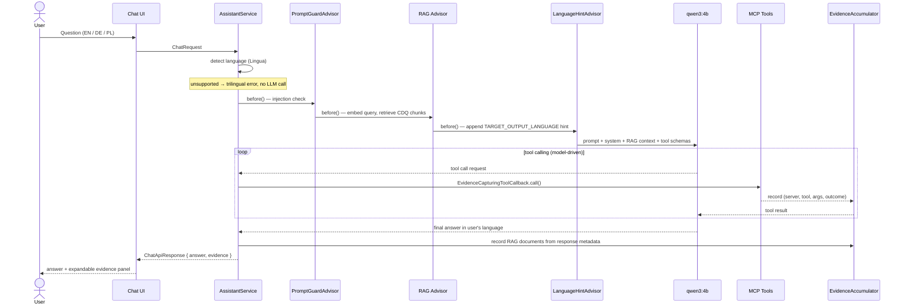
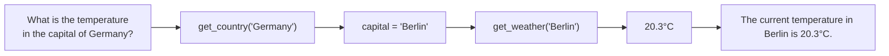

# CDQ AI Assistant

> A local-first AI assistant combining semantic product knowledge (RAG), real-time external data (MCP tool calling), and multi-tool orchestration — built with Spring AI, Ollama, and pgvector.

**Stack:** Java 21 · Spring Boot 4.1.1 · Spring AI 2.0.1 · Ollama `qwen3:4b` · pgvector · MCP

[Architecture](#architecture) · [Quick Start](#quick-start) · [Tests](#tests) · [Docs](#documentation)

---

## What this project demonstrates

| Capability | Where |
|---|---|
| **RAG** — CDQ Fraud Guard product knowledge from pgvector | [`rag/`](ai-assistant/src/main/java/com/example/cdq/rag/) |
| **Custom MCP server** — Countries REST service wrapped as Spring AI MCP | [`countries-mcp-server/`](countries-mcp-server/) |
| **External MCP integration** — Weather via stdio Node.js server | [`external/mcp-weather/`](external/mcp-weather/) |
| **Multi-tool chaining** — model resolves capital via Countries, then fetches weather | [`ChatEndToEndIT`](ai-assistant/src/test/java/com/example/cdq/chat/ChatEndToEndIT.java) |
| **Execution evidence** — every response carries tool calls + RAG source provenance | [`evidence/`](ai-assistant/src/main/java/com/example/cdq/evidence/) |
| **Multilingual responses** — EN / DE / PL via Lingua detection + prompt injection | [`InputLanguageDetector`](ai-assistant/src/main/java/com/example/cdq/chat/InputLanguageDetector.java) |
| **Versioned RAG lifecycle** — hash-based idempotent ingestion, rollback without re-embedding | [`lifecycle/`](ai-assistant/src/main/java/com/example/cdq/rag/lifecycle/) |
| **Benchmark-driven model selection** — `think=false` failure investigated and quantified | [`docs/why-ollama-instant.md`](docs/why-ollama-instant.md) |
| **Prompt injection guard** — pattern-based advisor at highest precedence | [`PromptGuardAdvisor`](ai-assistant/src/main/java/com/example/cdq/config/PromptGuardAdvisor.java) |
| **Local inference** — all LLM and embedding calls run through Ollama, no cloud API | `qwen3:4b-instruct` / `qwen3-embedding:0.6b` |

---

## Demo

> **TODO:** Record and add `docs/assets/demo.gif` (suggested content: 60–90 s showing a multilingual multi-tool chain question, the evidence panel expanding to reveal tool calls and RAG sources, and a language switch from EN to PL mid-session).

---

## Knowledge Sources

| Capability | Source | Integration | Example question |
|---|---|---|---|
| CDQ product knowledge | CDQ Fraud Guard page | RAG + pgvector | *"How does CDQ Fraud Guard verify bank accounts?"* |
| Country facts & capitals | REST Countries v5 | Custom MCP (HTTP) | *"What is the capital of Germany?"* |
| Current weather | WeatherAPI.com | External MCP (stdio) | *"What is the temperature in Munich?"* |
| Compound / multi-step | Multiple tools | Tool chaining | *"What is the temperature in the capital of Germany?"* |

**Why RAG for product knowledge and MCP for the rest?**

CDQ Fraud Guard content is static, structured, and domain-specific — semantic retrieval grounds the model precisely without tool round-trips. Country facts and weather data are real-time, external, and deterministic: a tool call returns an authoritative value the model cannot hallucinate. The separation keeps each path honest: RAG answers from retrieved text; tools answer from live APIs.

---

## Architecture


Three independent knowledge paths are presented to the LLM on every request. The model decides which to use — RAG context arrives automatically; tools are called only when needed.

---

## Request Flow



The advisor order is intentional: RAG runs **before** the language hint so the pgvector embedding query uses the clean original question, not the hint-augmented version. The hint is invisible to the embedding model but visible to the LLM.

---

## Tool Chaining

The model orchestrates multi-tool sequences without any hardcoded workflow. Example:



The tool description on `get_country` explicitly states: *"The returned 'capital' field can be used directly as input to the get_weather tool."* This single sentence is what enables reliable chaining — the model reads it and composes the sequence itself.

---

## Multilingual Behavior

The assistant mirrors the input language in every response path — model knowledge, RAG, and tool results.

**Detection pipeline (4 levels, first match wins):**

```
1. Character markers     [ą ć ę ł …] → Polish   [ä ö ü ß …] → German
2. Lingua statistical    ~75-language model — returns actual language or UNKNOWN
3. Unsupported check     ICELANDIC, FRENCH, CZECH … → trilingual error, no LLM call
4. Function word fallback  ist/sind/nicht → German   co/czy/jak … → Polish
```

Why a wide Lingua model (75 languages) rather than a narrow 3-language detector? A narrow detector is forced to return the nearest of 3 options — Icelandic is misclassified as English, Czech as Polish. The wide model returns `UNKNOWN` when confidence is genuinely too low, making the "unsupported" path reliable.

**Language hint injection:** After detection, `LanguageHintAdvisor` appends a bilingual instruction to the user message:

```
[Respond in Polish / Odpowiedz po polsku. Use English for tool arguments.]
```

The "Use English for tool arguments" clause prevents the model from passing `"Monachium"` instead of `"Munich"` to the weather tool.

Full design: [`docs/language-detection.md`](docs/language-detection.md)

---

## Task Verification

| Required question | Capability exercised | Status |
|---|---|---|
| *What is the capital city of Germany?* | Countries MCP → `get_country("Germany")` | ✅ |
| *What is the temperature currently in Munich?* | Weather MCP → `get_weather("Munich")` | ✅ |
| *What is the temperature of the capital of Germany currently?* | Tool chaining: Countries → Berlin → Weather | ✅ |
| *What do you know about Berlin?* | Model knowledge (no tool, no RAG) | ✅ |
| Own questions — see below | RAG + multi-tool compound | ✅ |

<details>
<summary>Sample responses (recorded from a live run, qwen3:4b-instruct)</summary>

**Q1 — Capital of Germany**
> The capital city of Germany is Berlin.

Routing: `get_country("Germany")` → capital field from REST Countries API.

---

**Q2 — Temperature in Munich**
> The current temperature in Munich is 18.9°C.

Routing: `get_weather("Munich")` → WeatherAPI.com.

---

**Q3 — Temperature in capital of Germany**
> The current temperature in the capital of Germany, Berlin, is 20.3°C.

Routing: `get_country("Germany")` → capital = "Berlin" → `get_weather("Berlin")`. Two MCP calls in sequence.

---

**Q4 — What do you know about Berlin?**
> Berlin is the capital city of Germany. It is located in the central part of the country and is one of the most populous cities in Europe. Berlin is known for its rich history, cultural diversity, and vibrant arts and music scene.

Routing: No tool calls, no RAG. The system prompt allows model knowledge for broad, non-time-sensitive city questions.

---

**Own: How does CDQ Fraud Guard reduce manual work?**
> CDQ Fraud Guard reduces manual work by automating repetitive data-lookup and cross-referencing tasks for finance and risk teams. It leverages community-shared data and real-time fraud intelligence to eliminate the need for manual verification of bank accounts and transaction partners.

Routing: RAG — retrieved from local CDQ Fraud Guard knowledge base.

---

**Own: What is the population of France, and what is the weather in its capital?**
> France has a population of approximately 67,391,582. The current weather in Paris, the capital of France, is 22.1°C.

Routing: `get_country("France")` → population + capital = "Paris" → `get_weather("Paris")`.

> **Note:** Weather readings are dynamic — the temperatures shown above reflect the live run at time of recording, not current conditions.

</details>

---

## Beyond the Requirements

| Feature | What was done | Details |
|---|---|---|
| **Versioned RAG document lifecycle** | SHA-256 content + pipeline fingerprinting; idempotent ingestion (restart is free if content unchanged); ACTIVE→RETIRED→rollback without re-embedding; `REQUIRES_NEW` transaction isolates failure marking | [docs/rag-document-lifecycle.md](docs/rag-document-lifecycle.md) |
| **Execution evidence** | Every response includes `ExecutionEvidence`: tool calls (server, tool, args, outcome, errorCode) + RAG documents (sourceId, sourceUrl, section, chunkIndex, sourceVersionId); visible in the UI evidence panel | [`evidence/`](ai-assistant/src/main/java/com/example/cdq/evidence/) |
| **Benchmark-driven model selection** | Direct Ollama and full Spring AI pipeline benchmarks showed `qwen3:4b` generates ~2 400 output tokens per RAG request (thinking not suppressible via `think=false`) vs ~65 for instruct variant; ~34× latency difference on warm RAG path | [docs/why-ollama-instant.md](docs/why-ollama-instant.md) · [docs/model-performance.md](docs/model-performance.md) |
| **4-tier language detection** | Lingua statistical model + char-level markers + function word fallbacks; unsupported languages short-circuited before LLM call | [docs/language-detection.md](docs/language-detection.md) |
| **Multi-tool chaining tested** | Full E2E tests with real Ollama + real MCP servers confirming the country→capital→weather chain in EN/DE/PL | [`ChatEndToEndIT`](ai-assistant/src/test/java/com/example/cdq/chat/ChatEndToEndIT.java) |
| **RAG retrieval tuning** | Similarity threshold 0.5; top-K 4; active-version filter; header_1 chunk excluded; two sections rewritten to prevent embedding collisions | [docs/rag-ingestion-pipeline.md](docs/rag-ingestion-pipeline.md) |
| **Prompt injection guard** | `PromptGuardAdvisor` at `HIGHEST_PRECEDENCE` — 14 regex patterns including model-specific control tokens (`[INST]`, `<<SYS>>`, `im_start`) | [`PromptGuardAdvisor.java`](ai-assistant/src/main/java/com/example/cdq/config/PromptGuardAdvisor.java) |
| **Weather MCP fork** | 3 patches applied: portable env config (removed dotenv), improved tool description for reliable LLM selection, structured JSON responses for evidence decoding | [`external/mcp-weather/PATCH.md`](external/mcp-weather/PATCH.md) |
| **Deployment infrastructure** | Multi-stage Dockerfiles for ai-assistant and countries-mcp-server; `railway.toml`; entrypoint with Ollama readiness wait | `Dockerfile`, `Dockerfile.countries`, `ai-assistant-entrypoint.sh` |

---

## Model Selection

The task specifies `qwen3:4b`. This model is fully supported — switch with one env var:

```bash
OLLAMA_CHAT_MODEL=qwen3:4b java -jar ai-assistant/target/ai-assistant-0.1.0-SNAPSHOT.jar
```

The default is `qwen3:4b-instruct`, chosen after running benchmarks:

| Scenario | `qwen3:4b` | `qwen3:4b-instruct` |
|---|---:|---:|
| Simple question | ~9.9 s / 604 tok | ~0.16 s / 9 tok |
| CDQ question, no context | ~41.7 s / 2 695 tok | ~0.65 s / 37 tok |
| Full Spring AI RAG (warm) | ~41.6 s / ~2 409 tok | ~1.23 s / 65 tok |
| Spring AI overhead (advisors + pgvector) | ~111 ms | ~74 ms |

Root cause: `think=false` in the Ollama API does not suppress reasoning for `qwen3:4b` in the tested setup — the model routes its reasoning block to `message.content` instead of `message.thinking`, leaving token count and latency unchanged. Both models run at ~60–65 tok/s; the difference is entirely in tokens generated. This matches [4 independent community reports](docs/why-ollama-instant.md#ollama-community-reports).

→ [Full model selection rationale and raw benchmark data](docs/why-ollama-instant.md)  
→ [Benchmark methodology and Spring AI overhead analysis](docs/model-performance.md)

---

## Quick Start

**Prerequisites:**
- Java 21+
- Docker (for pgvector)
- [Ollama](https://ollama.com) installed and running locally
- Node.js 18+ (for the weather MCP server)
- Two free API keys (see below)

### 1. Pull Ollama models

```bash
ollama pull qwen3:4b-instruct      # default chat model
ollama pull qwen3:4b               # task-specified model (optional)
ollama pull qwen3-embedding:0.6b   # embedding model — required
```

### 2. Get API keys

Both are free tier, no credit card required:

| Service | Sign up | Purpose |
|---|---|---|
| REST Countries v5 | https://restcountries.com/sign-up | Country data |
| WeatherAPI.com | https://www.weatherapi.com/signup.aspx | Current weather |

### 3. Configure

```bash
cp .env.example .env
# Edit .env: set WEATHER_API_KEY=your_key

# Edit countries-mcp-server/.env (create if missing):
# REST_COUNTRIES_API_KEY=your_key
# REST_COUNTRIES_BASE_URL=https://api.restcountries.com
```

### 4. Start PostgreSQL

```bash
docker compose up -d postgres
```

### 5. Build the weather MCP server (once after checkout)

```bash
cd external/mcp-weather && npm install && npm run build && cd ../..
```

### 6. Start the Countries MCP server

```bash
# In a separate terminal
./mvnw spring-boot:run -pl countries-mcp-server
# Wait for: Started CountriesMcpApplication (~2 s)
```

### 7. Start the AI assistant

```bash
./mvnw -pl ai-assistant package -DskipTests
java -jar ai-assistant/target/ai-assistant-0.1.0-SNAPSHOT.jar
# Wait for: Started AssistantApplication
# RAG ingestion runs automatically on first start (~5 s)
```

Open **http://localhost:8080**

> **Windows + SSL-intercepting antivirus (Avast, Kaspersky, ESET, Norton)?**
> These tools replace TLS certificates, causing `PKIX path building failed` when calling REST Countries.
> Fix: tell the JVM to trust the Windows certificate store:
> ```bash
> java -Djavax.net.ssl.trustStoreType=Windows-ROOT -jar ai-assistant/target/ai-assistant-0.1.0-SNAPSHOT.jar
> ```

---

## Configuration

| Variable | Default | Description |
|---|---|---|
| `OLLAMA_CHAT_MODEL` | `qwen3:4b-instruct` | Chat model — set to `qwen3:4b` for task-exact compliance |
| `OLLAMA_BASE_URL` | `http://localhost:11434` | Ollama server URL |
| `POSTGRES_DB` | `cdq_assistant` | Database name |
| `POSTGRES_USER` | `cdq` | Database user |
| `POSTGRES_PASSWORD` | `cdq_secret` | Database password |
| `RAG_SIMILARITY_THRESHOLD` | `0.5` | Minimum cosine similarity for retrieval |
| `WEATHER_API_KEY` | _(empty)_ | WeatherAPI.com free tier key |
| `COUNTRIES_MCP_URL` | `http://localhost:8081` | Countries MCP server base URL |
| `WEATHER_MCP_SCRIPT` | `external/mcp-weather/dist/index.js` | Path to weather MCP Node.js script |
| `PORT` | `8080` | HTTP port for the AI assistant |

---

## Tests

### Unit tests (no external dependencies)

```bash
./mvnw test -pl ai-assistant
./mvnw test -pl countries-mcp-server
```

### Integration tests (requires Docker + Ollama)

```bash
./mvnw verify -Pintegration -pl ai-assistant
```

Testcontainers starts pgvector automatically. Total time ~2–5 minutes.

### Run a specific suite

```bash
./mvnw verify -Pintegration -pl ai-assistant -Dit.test=ChatEndToEndIT
```

> `ChatEndToEndIT` additionally requires the countries MCP server running and `WEATHER_API_KEY` in `.env`.

### Performance benchmarks (opt-in, requires Ollama)

```bash
# Full pipeline — qwen3:4b-instruct (default)
RUN_FULL_BENCH=true ./mvnw failsafe:integration-test -Pintegration \
  -pl ai-assistant -Dit.test=FullPipelineBenchmarkIT

# Model comparison — both models, direct Ollama + Spring AI path
RUN_LATENCY=true ./mvnw failsafe:integration-test -Pintegration \
  -pl ai-assistant -Dit.test=ChatModelBenchmarkIT
```

Reports: `ai-assistant/target/full-pipeline-report.txt`, `model-comparison-report.txt`

### Test coverage summary

| Area | Tests | Type |
|---|---|---|
| RAG retrieval quality | `RagPipelineIT` (17/19 active) | Integration — Hit@1/Hit@3, cross-lingual EN/PL/DE, negative |
| RAG document lifecycle | `DocumentLifecycleIT` (16) | Integration — idempotency, change detection, rollback guards |
| Chat + RAG quality | `ChatRagIT` (15) | Integration — EN/PL/DE queries, evidence verification, negative |
| Tool routing | `ChatToolRoutingIT` | Integration — real LLM, fake MCP |
| Multilingual responses | `ChatMultiLanguageIT` | Integration — real LLM, fake MCP |
| Full E2E | `ChatEndToEndIT` (15) | Integration — real Ollama + real MCP + real weather |
| Embedding model | `EmbeddingModelIT` (7) | Integration — dimension, L2-norm, cross-lingual |
| Document chunking | `DocumentProcessorTest` (21) | Unit |
| Language detection | `InputLanguageDetectorTest` | Unit |
| Evidence accumulation | `EvidenceAccumulatorTest` | Unit |
| Cosine similarity math | `CosineSimilarityTest` (5) | Unit |
| Countries MCP client | `RestCountriesClientTest` | Unit (WireMock) |
| Weather MCP handler | `weather-handler.test.ts` (5) | Unit (Vitest) |
| RAG version isolation | `ChatVersionIT` | Integration — confirms only ACTIVE version chunks reach the LLM |
| Model latency | `ChatModelBenchmarkIT`, `FullPipelineBenchmarkIT`, `ChatLatencyIT` | Benchmark (opt-in) |

---

## Key Design Decisions

### RAG for product knowledge, tools for real-time data

CDQ Fraud Guard content is static and domain-specific. Semantic retrieval grounds the model in actual product documentation without tool round-trips or hallucination. Country facts and weather are live, external, and deterministic — a tool call returns an authoritative value the model cannot fabricate.

### Advisor ordering: RAG before language hint

`LanguageHintAdvisor` runs at `ToolCallingAdvisor.DEFAULT_ORDER - 25`; `RetrievalAugmentationAdvisor` runs at `DEFAULT_ORDER - 50`. This ensures the pgvector embedding query uses the clean original question — the language hint is appended only after retrieval, so it is invisible to the embedding model but visible to the LLM.

### Versioned document lifecycle over simple re-ingestion

`DocumentLifecycleService` uses SHA-256 content hashing and a pipeline fingerprint (model + dimensions + processor version) to detect changes. A restart with unchanged content makes zero Ollama calls. Ingestion failures do not corrupt the currently serving ACTIVE version — `markFailed()` runs in a separate `REQUIRES_NEW` transaction. Retired versions remain in pgvector for zero-cost rollback. See [docs/rag-document-lifecycle.md](docs/rag-document-lifecycle.md).

### qwen3:4b-instruct as default

`think=false` does not suppress reasoning tokens in the tested `qwen3:4b` Ollama setup. The warm RAG response time is ~41.6 s for the thinking model vs ~1.23 s for the instruct variant. The task-required model is fully supported via `OLLAMA_CHAT_MODEL=qwen3:4b`. See [docs/why-ollama-instant.md](docs/why-ollama-instant.md).

### No conversational memory

Long-term and short-term memory are explicitly out of scope per the task definition. Each request is fully independent.

---

## AI Usage

This project was built with [Claude Code](https://claude.ai/code) (`claude-sonnet-4-6`) as the primary AI tool. All sessions were interactive — the developer directed the work, reviewed every change, ran all benchmarks, and made all architectural decisions.

Areas where AI accelerated implementation: Spring AI configuration, Testcontainers setup, WebClient integration, evidence model design, test implementations. Areas requiring more developer iteration: RAG similarity threshold tuning, system prompt engineering, benchmark interpretation, advisor ordering rationale.

The AI occasionally suggested over-engineered solutions or made incorrect API assumptions — caught during review.

→ [Full AI usage notes and honest assessment](AI_USAGE.md)

---

## Project Structure

```
.
├── ai-assistant/                        # Spring Boot app — port 8080
│   └── src/main/java/com/example/cdq/
│       ├── chat/       # AssistantService, InputLanguageDetector, ChatController
│       ├── config/     # ChatConfig, LanguageHintAdvisor, PromptGuardAdvisor
│       ├── evidence/   # EvidenceAccumulator, EvidenceCapturingToolCallback
│       └── rag/        # DocumentProcessor, RagRetrieval, lifecycle/
├── countries-mcp-server/                # Spring AI MCP server — port 8081
│   └── src/main/java/com/example/cdq/countries/
│       ├── tool/       # CountryTool (@McpTool)
│       └── client/     # RestCountriesClient (WebClient)
├── external/
│   └── mcp-weather/                     # Forked Node.js MCP server (stdio)
├── docs/                                # Engineering decision records
│   ├── why-ollama-instant.md            # Model selection rationale + think=false analysis
│   ├── model-performance.md             # Full benchmark methodology and raw results
│   ├── language-detection.md            # 4-tier detection design
│   ├── rag-document-lifecycle.md        # Versioned ingestion state machine
│   ├── rag-ingestion-pipeline.md        # Chunking, metadata, retrieval tuning
│   └── embedding-model.md              # Embedding model choice rationale
├── docker-compose.yml                   # pgvector/pgvector:pg17
├── Dockerfile                           # Multi-stage: ai-assistant + weather MCP
├── Dockerfile.countries                 # Countries MCP server
├── Dockerfile.ollama                    # Ollama container with readiness entrypoint
├── railway.toml                         # Railway deployment config
├── .env.example
└── AI_USAGE.md
```

---

## Documentation

| Document | Contents |
|---|---|
| [docs/why-ollama-instant.md](docs/why-ollama-instant.md) | Why `qwen3:4b-instruct` is the default; `think=false` analysis; community issue references |
| [docs/model-performance.md](docs/model-performance.md) | Full benchmark methodology: direct Ollama measurements, Spring AI pipeline timing, overhead breakdown |
| [docs/language-detection.md](docs/language-detection.md) | 4-tier detection pipeline; LanguageHintAdvisor ordering; test coverage |
| [docs/rag-document-lifecycle.md](docs/rag-document-lifecycle.md) | Version state machine; hash/fingerprint strategy; transaction boundaries; rollback |
| [docs/rag-ingestion-pipeline.md](docs/rag-ingestion-pipeline.md) | Markdown chunking; metadata per chunk; retrieval tuning; embedding collision fixes |
| [docs/embedding-model.md](docs/embedding-model.md) | Why `qwen3-embedding:0.6b`; cross-lingual capability; MTEB comparison |
| [AI_USAGE.md](AI_USAGE.md) | Transparent AI usage disclosure; what AI did; what developer did; honest assessment |

---

## Known Limitations

- **No conversation memory.** Each question is an independent request. Out of scope per task definition.
- **CDQ content is a local Markdown file.** Manually scraped from `https://www.cdq.com/products/cdq-fraud-guard` and committed. The pipeline does not fetch from the live URL at runtime. Source URL is stored as provenance metadata on every chunk. Reproducibility takes priority over live content staleness.
- **Language support limited to English, German, Polish.** Questions in other languages return a trilingual error; the LLM is not called. [Design rationale and known edge cases](docs/language-detection.md#known-limitations).
- **Weather MCP requires Node.js 18+.** `npm install && npm run build` must be run once after checkout.
- **API keys required.** REST Countries v5 and WeatherAPI.com both require free registration. Without keys, country and weather tool calls return errors.
- **German cross-lingual RAG regression (instruct model).** Retrieval returns correct English chunks for German queries; `qwen3:4b-instruct` occasionally declines to answer from English context when queried in German. `qwen3:4b` handles this correctly. [Details](docs/why-ollama-instant.md#known-trade-offs).
- **CPU inference latency.** Results above were measured on a local GPU. CPU-only Ollama will be significantly slower.
